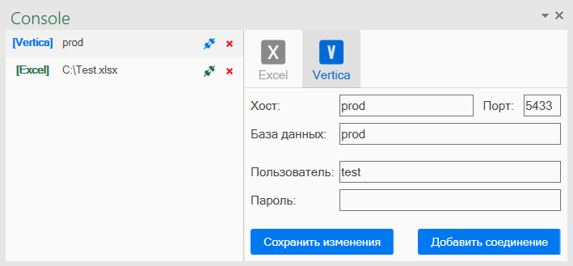

# ExTools
### Консоль SQL запросов для Excel

Основной функционал
- управление подключениями и файлами запросов
- подключение к текущей или другим книгам Excel
- подключение к Vertica
- вывод результата запроса на указанный лист
- одновременная работа в нескольких открытых книгах

Горячие клавиши
- Ctrl + R - выполнить скрипт
- Ctrl + Shift + R - выполнить выделенный скрипт
- Ctrl + S - сохранить
- Ctrl + Shift + C - скопировать скрипт для вставки в VBA
---
Подключение к текущей книге:

Управление подключениями:

